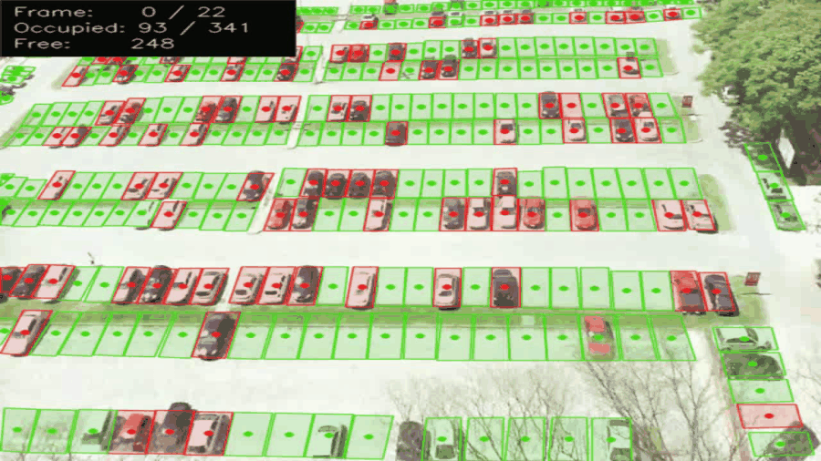

# parksense

Counts occupied and free parking spaces from a single fixed camera, with no per-space sensors.



## What it does

A parking lot is watched by one overhead camera. Each space is defined once as a polygon; from then on every frame is scored and the lot's occupancy is reported. There is no hardware in the ground, no per-space wiring, and no per-camera model training — moving the system to a new lot means drawing new polygons, not collecting a new dataset.

The detector is a YOLOv8 model fine-tuned on over ten thousand hand-cleaned overhead parking images, which labels each space directly as `Empty` or `Occupied`. A stock COCO detector is a poor fit here: it learned cars in side profile, while an overhead camera only ever sees roofs.

## How it works

1. **Define the spaces.** `--discover-slots` extracts a reference frame and serves a local editor in the browser. You draw one polygon per space, drag vertices to fit, and save. The result is a JSON file of polygons, tied to that camera's viewpoint.
2. **Detect.** Each frame is run through the model, producing `Empty` / `Occupied` boxes.
3. **Assign to a space.** Each detection's centroid is tested against every polygon with `cv2.pointPolygonTest`. A space containing a non-empty detection is marked occupied.
4. **Render.** Spaces are filled red or green over the frame, with an occupied / free counter in the corner.

Two decisions worth calling out:

**Polygons, not a bounding-box grid.** An overhead camera sees spaces in perspective, so they are slanted quadrilaterals that change shape across the frame. Axis-aligned boxes cannot follow that without overlapping their neighbours, which then makes assignment ambiguous exactly where the lot is densest.

**Centroid-in-polygon, not IoU.** At this angle a car's bounding box spills into the spaces on either side, so an overlap threshold marks neighbours occupied too. Testing only the centroid gives each vehicle exactly one space, and the failure mode becomes a miss rather than a spreading false positive — which is the right trade when the output is a free-space count.

`--tiled` offers a second inference strategy: the frame is split into an overlapping grid, and the tiles are upscaled and batched into a single model call. A car covering few pixels in the full frame covers many in its tile, at roughly the cost of one full-frame pass.

## Setup

Python 3.12.

```bash
python -m venv .venv
source .venv/bin/activate      # Windows: .venv\Scripts\activate
pip install -r requirements.txt
```

The weights are not in the repository. Download `parking_best_ep13.pt` from the [releases page](../../releases) and put it in `models/`.

You also need footage. Any fixed overhead view of a parking lot works; the [PKLot dataset](https://web.inf.ufpr.br/vri/databases/parking-lot-database/) is a convenient source of one. Put it at `videos/lot.mp4`, or point `video.source` in `config.yaml` somewhere else.

## Usage

Run on any video and save the annotated result:

```bash
python main.py --video path/to/lot.mp4 --save outputs/result.mp4 --no-display
```

Inspect a single frame:

```bash
python main.py --frame 0 --save outputs/frame0.jpg --no-display
```

Set up a new camera — draw the spaces once, then run against them:

```bash
python main.py --video path/to/lot.mp4 --discover-slots
```

This opens the editor at `http://127.0.0.1:5050`. Click to place vertices, drag a vertex to reshape a space, drag its body to move it, then save. Point `parking.slots_path` in `config.yaml` at the file it writes. `examples/slots_demo.json` shows the format — a list of `{id, points}`, 341 spaces for one lot.

Use the tiled inference path instead of a single full-frame pass:

```bash
python main.py --tiled --save outputs/result.mp4 --no-display
```

Everything tunable — model path, confidence, inference size, tile grid, editor port — lives in `config.yaml`. Common values are also exposed as flags; run `python main.py --help` for the full list.

## Tech stack

Python 3.12, YOLOv8 (Ultralytics), OpenCV, Flask, plain HTML/SVG for the editor.

## Notes and limitations

- The camera must be fixed. Space polygons are tied to one viewpoint, so any pan, zoom or remount means redrawing them.
- Occupancy is decided per frame with no temporal smoothing, so a space can flicker between states when a detection is marginal.
- A space that receives no detection at all is rendered as free. Under heavy occlusion — a van hiding the space behind it, or a tree shadowing a row — the free count reads high.
- The model was fine-tuned on daylight overhead imagery. Night, heavy rain and snow are outside what it has seen.
